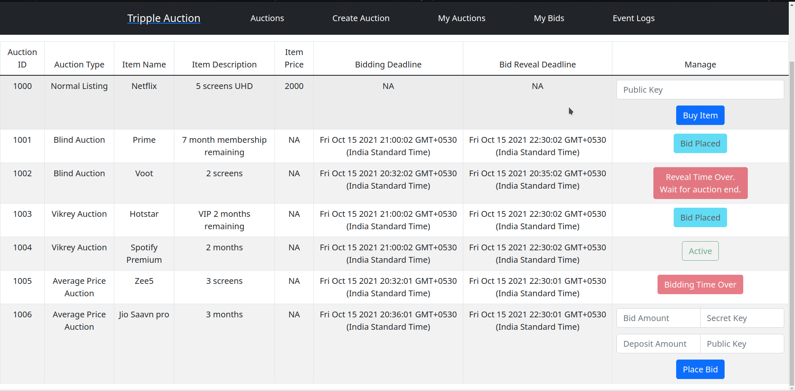
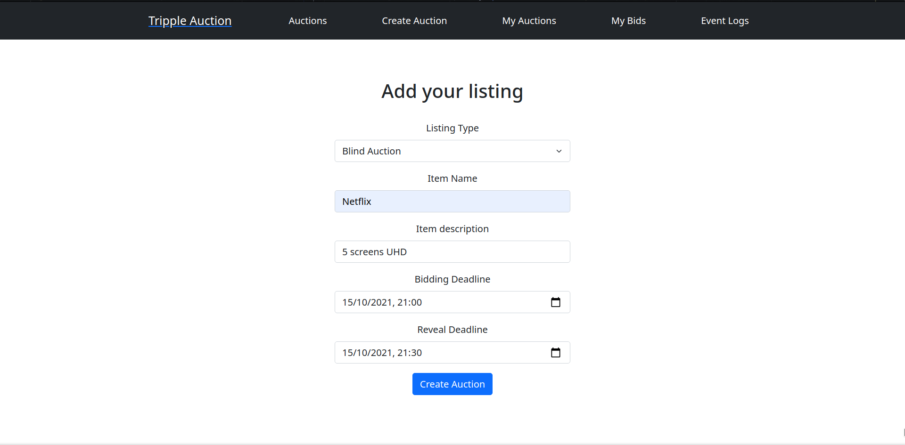
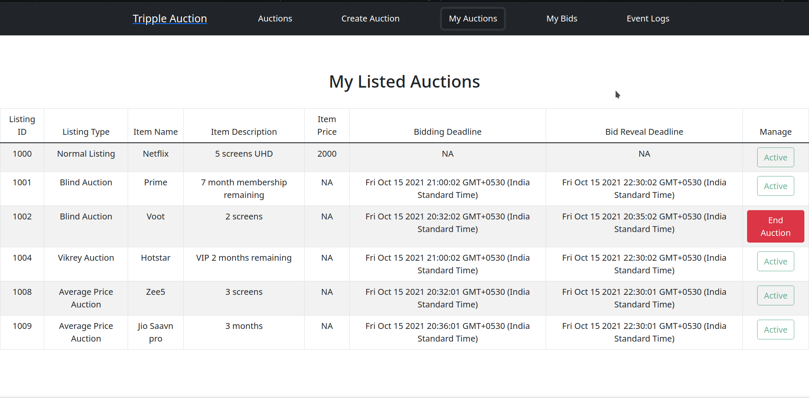
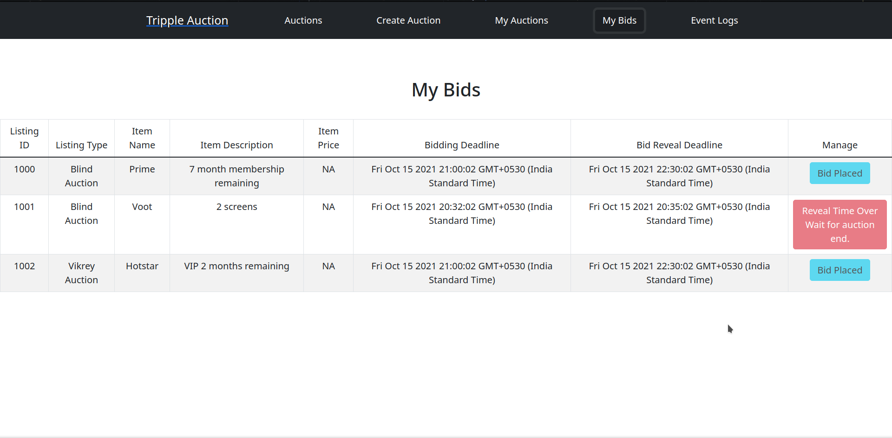
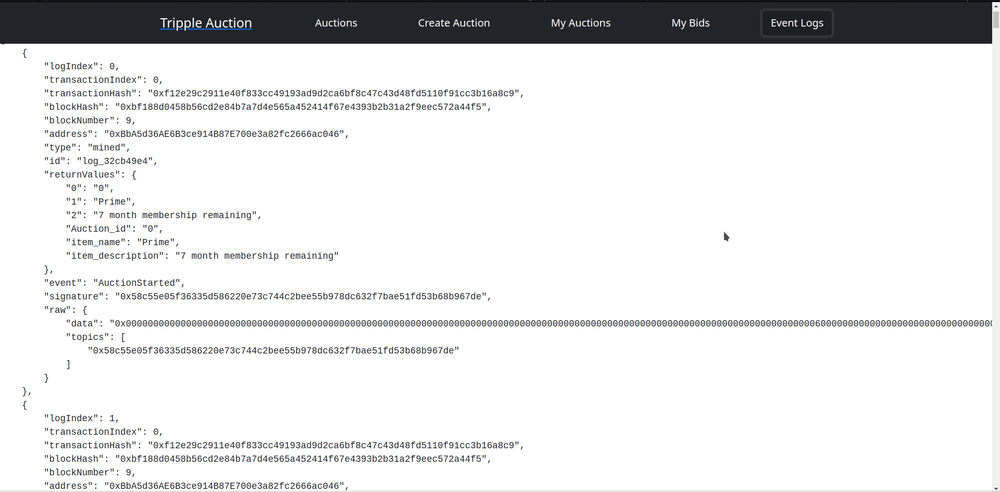

# Auction House

**Team**: Tripple
- [Tathagato Roy](https://github.com/tathagatoroy)
- [Snehal Kumar](https://github.com/snehalkumar5)
- [Rutvij Menavlikar](https://github.com/Rutvij-1)

---

## Backend(Smart Contracts)

### Programming Logic

#### Market 

The smart contract `Market` contains a struct of item listings and its details. Each listing contains the item details required, the seller and buyer address and its current state.
For every change in the struct caused by the fuction calls, an event is emitted, updating the states of the listings as required.
The transactions follow a procedure based on trust to ensure the validity and atomicity of the transaction:
1. A buyer selects a valid active listing to purchase and sends a request to buy.
2. To request a purchase, the buyer must submit a deposit of 2 time the item price and the seller is notified. 
3. The seller then confirms the deposited amount and sends an encrypted hash key for the item. This ensures the security of transaction such that it is not leaked to any other person.
4. The item is then delivered to the buyer after which they are refunded the additional deposited amount, and the seller gets the asking price of the item.

##### Making a Listing

- The method `createListings` takes input the price, name and description of the item and it assigns it a unique id, stores the unique seller id for it and sets it's status to indicate that the item is available.
- Then it emits 2 events.
    - `ListingCreated`
    - `ListingChanged` to indicate its creation.

---

##### Viewing Listings

- The method `fetchactivelistings` goes through all the listings created, stores all listings whose item's status is available and returns them.

---

##### Buying an Item

- The method `requestBuy` takes input as the listing unique id of the item to be bought and checks if it is a valid listing id and if the item is available.
- Then it emits an event `PurchaseRequested`
- Then the method `sellItem` takes input listing id and the unique string to be assigned to the item.
- Then it emits an event `encryptedKey`

---

##### Delivery

- The method `confirmDelivery` is responsible for ensuring the delivery of the sold item by the seller. It checks the existence of valid listing Id, and proceeds to transfer 3*item_price to the seller and item_price to the buyer. This ensures the security and completeness of the transaction after which the state of the listing and active listings are updated.

---

##### Transactions

- The buyer and the seller must escrow two times of the listing price to the contract.The buyer will send the money when he/she makes a request to buy and the seller when he/she sends the item.This is done to ensure trust and motivate the parties to act fairly.
- The seller will get 3 times the listing price (initial deposit + listing price) and buyer will get the listing price (initial deposit -listing price) after the purchase is confirmed by the buyer.

---

##### Modifiers

- Several modifiers are used to ensure the valid actions are taken during execution of a function. They are:
    - Checking whether a listing is valid
    - Checking the valid state of the item listing
    - Checking whether the buyer/seller are eligible to execute a particular method
    - Checking the sufficient balance of an account before transaction
    - Checking if the string of the item has length less than or equal to 50.

---

#### Auction

- The smart Contracts `BlindAuction`, `VikreyAuction` and `AveragePriceAuction` handle the functionality to facilitate the respective Auctions. It allows any user to setup an auction for an item and specify time period for bidding and revealing time period. In the bidding period,the bidders send their blinded bid(hashed) along with their public key,in case they win the auction. They also deposit a amount which is atleast twice the amount of their intended bid. After Bidding period ends, the revealing period starts where the bidders submit the value and the secret string they used to hash the bid.The contract verifies that the amount revealed is consistent with the hashed value and  that the deposit is sufficient. The contract then makes the neccessary refund and keeps track of the winning bid and the winner.
- After the revealing period ends the beneficiary/seller calls the auction to the end,at which points the contract emits an event to let everyone know who the winner is and how much the final bid is. It also refunds any pending return to any bidder who succesfully revealed their bid. The contract also emits the public key of the winner. The seller makes note of the above event and sends hash of the item it wants to sell. It is hashed using public key of the buyer. The seller is also required to deposit an amount two times the winning bid for security purposes. The contract then emits the hashed item using an event. The Winner decrypts the hashed string using his/her private key off-chain and then confirms to the contract that the delvery is successful.
- At this point the Contract deposits 3 times the winning bid (the initial deposit + selling price) to the seller and the amount equivalent to the winning bid to the buyer(refund for the deposit) and this concludes the auction. 
- The key logical difference between the three Auction types is coded in functions `placeBid` and `auctionEnd`
    - **Blind Auction**: In `placeBid`, if the current bid value is higher than previous greatest, the winning bid and bidder are updated. Otherwise that bid is discarded, and their pending return is stored. In `auctionEnd` the pending returns of all bidders are returned.
    - **Vikrey Auction**: In `placeBid`, if the current bid value is higher than previous greatest the winning bid and bidder are updated, if the bid is between highest and second highest bid the winning bid is updated. Otherwise that bid is discarded, and their pending return is stored. In `auctionEnd` the pending returns of all bidders are returned.
    - **Average Price Auction**: In `placeBid`, just the total sum of bid is updated. In `auctionEnd` the pending returns of all bidders are returned, and except for bidder whose bid is closest to average, the rest of the bidder's deposit is returned.

##### Secrecy of Bids

- To ensure secrecy of bids, the bid values are not known to anyone but the bidder during the bidding period.
- Instead, the hash of bid value with a secret string is passed while bidding. This hash can neither be decrypted, nor can it be found without knowing the secret string.

---

#### UI Design

The UI has been divided into 4 main parts:

##### Auctions

Fetches all active auction/market listings



---

##### Create Auction

Enables the user account to add their own item as listing/auction in the market



---

##### MyAuctions

Enables the user to check on their created auctions and current status



---

##### MyBids

Enables the user to place bids/request to buy items that are active and check on their status after being sold.



---

##### Events Log

Shows the logs of all the events occurred in the blockchain.



---

#### Web App

##### Installation

Starting from the assignment directory, the following commands should install the app.
```bash
cd client/
npm install
```

##### Running

*Backend*:
In another terminal window, run
```bash
truffle develop 
```
Then in the truffle console, run
```bash
compile
migrate
```
*Frontend*:
In the terminal where you installed the app, run
```bash
npm start
```

---

#### Truffle Console

##### Installation

Starting from the assignment directory, run
```bash
npm install eth-crypto --save
```

##### Running

```bash
truffle develop 
```

After that you can use the commands shown in the test files `blind_test.txt`, `vickrey_test.txt` and `average_test.txt` which can be found in `test/` directory.

*Note: the expected result has been given in comment format in the test files*
